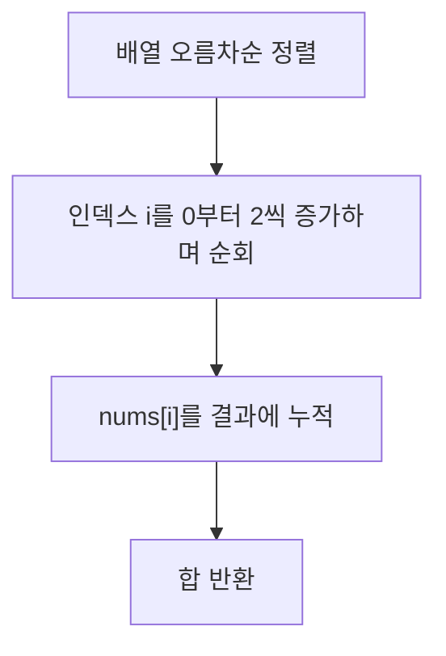

# Chapter 01-10
**LeetCode 561. Array Partition**

## Table of contents
1. [문제 설명](#1-문제-설명)
1. [문제 접근 방법](#2-문제-접근-방법)
1. [알고리즘 순서도](#3-알고리즘-순서도)
1. [코드](#4-코드)
1. [복잡도 분석](#5-복잡도-분석)
1. [내용 정리](#6-예상-질문)
1. [다른 풀이](#7-다른-풀이-방법)

---

## 1. 문제 설명

```text
Given an integer array nums of 2n integers, group these integers into n pairs (a1, b1), (a2, b2), ..., (an, bn) such that the sum of min(ai, bi) for all i is maximized. Return the maximized sum.
```

> 주어진 숫자 배열을 쌍으로 조합할 경우, 각 쌍 최소값 합이 최대가 되도록

### Constraints:
- `1 <= n <= 10⁴`
- `nums.length == 2 * n`
- `-10⁴ <= nums[i] <= 10⁴`


### 예시

```bash
Input: nums = [1,4,3,2]
Output: 4

Explanation: All possible pairings (ignoring the ordering of elements) are:
1. (1, 4), (2, 3) -> min(1, 4) + min(2, 3) = 1 + 2 = 3
2. (1, 3), (2, 4) -> min(1, 3) + min(2, 4) = 1 + 2 = 3
3. (1, 2), (3, 4) -> min(1, 2) + min(3, 4) = 1 + 3 = 4
So the maximum possible sum is 4.
```

```bash
Input: nums = [6,2,6,5,1,2]
Output: 9

Explanation: The optimal pairing is (2, 1), (2, 5), (6, 6). 
min(2, 1) + min(2, 5) + min(6, 6) = 1 + 2 + 6 = 9.
```

---

## 2. 문제 접근 방법

### 핵심 아이디어 💡
- 배열 오름차순 정렬
- 짝수 인덱스에 있는 값들을 더하면, 각 쌍의 min 값을 구하는 것과 같음
  - 정렬이 된 배열의 경우, 인접한 숫자를 쌍으로 묶으면 min 값들의 합이 최대가 됨

> 이 문제는 그리디 전략에 기반

---

## 3. 알고리즘 순서도



### 값의 변화 과정
예시: `nums = [1, 2, 3, 4]`

| 순회 | i  | nums[i] | 누적 합 |
|------|----|---------|---------|
|  1   | 0  | 1       | 1       |
|  3   | 2  | 3       | 4       |


예시: `nums = [1, 2, 2, 5, 6, 6]`

| 순회 | i  | nums[i] | 누적 합 |
|------|----|---------|---------|
|  1   | 0  | 1       | 1       |
|  2   | 2  | 2       | 3       |
|  3   | 3  | 6       | 6       |

___

## 4. 코드

### Pseudocode

```plaintext

```

### 풀이 코드

```ts
function arrayPairSum(nums: number[]): number {
  let result: number = 0;
  nums.sort((a, b) => a - b);

  for (let i = 0; i < nums.length; i = i + 2) {
    result += nums[i];
  }

  return result;
}
```

---

## 5. 복잡도 분석

### 코드 분석

```ts
// TC: O(n log n) + O(n/2)
// SC: O(1)
// 계산 복잡도에서는 더 큰 성장을 보이는 항이 지배항이 됨
function arrayPairSum(nums: number[]): number {
  let result: number = 0; // SC: O(1)
  const arr = nums.slice().sort((a, b) => a - b); // TC: O(n log n)

  for (let i = 0; i < arr.length; i = i + 2) { // TC: O(n/2), 짝수 인덱스 순회
    result += arr[i];
  }

  return result;
}
```

### 시간 복잡도 ⏳
> 1.	반복문의 실행 횟수를 먼저 보기
> 2.	반복 안에서 실행되는 연산 수를 체크
> 3.	입력의 크기(n)에 따라 얼마나 시간이 늘어나는지 판단

- sort()는 JS 엔진(V8)에서 Timsort 또는 Merge Sort 기반 → O(n log n)

- 정렬: O(n log n)
- 순회: O(n)
- 총 시간 복잡도: O(n log n)

### 공간 복잡도 🗃️
> 1. 배열, 객체 등 추가적인 자료구조를 새로 만들었는지 보기
> 2. 그 자료구조의 크기가 입력 크기(n)에 비례하는지 체크
> 3. 변수만 사용한 경우는 O(1)로 봄

- 추가적인 배열이나 객체 사용 없이 정렬과 변수만 사용 → O(1)

### Big-O 분석 요약
- 평균 시간 복잡도: O(n log n)
- 최악 시간 복잡도: O(n log n)
- 공간 복잡도: O(1)

---

## 6. 내용 정리

### 3줄 요약 (Summary)
- 배열을 오름차순 정렬한다.
- 짝수 인덱스 요소만 더하여 최소값 합을 최대화한다.
- 그리디 전략을 적용하여 효율적으로 해결한다.

### 이번 문제를 통해 배운 점
- 정렬 후 단순 순회만으로 최적의 결과를 낼 수 있는 그리디 전략을 익힘
- 중첩 반복이나 이진 탐색이 불필요한 상황도 많다는 것

### 질문 & 한 줄 답변
- Q: 왜 정렬 후 짝수 인덱스만 더해야 할까?
- A: 인접한 수를 쌍으로 묶으면, 각 쌍의 최소값이 짝수 인덱스가 되기 때문

---

## 7. 다른 풀이

### 다른 풀이 방법

### 다른 풀이 방법을 사용하지 않은 이유
- 시간 복잡도와 구현 난이도에서 정렬 기반 그리디 방법이 더 효율적이기 때문

#### 그리디 전략이란?
그리디 전략(Greedy Algorithm):
- 매 순간 가장 좋아 보이는 선택(국소 최적)을 하는 전략
- 이렇게 선택한 결과들이 모여서 **전체 최적해(Global Optimum)**가 되기를 기대하는 방식

🔍 LeetCode 561 문제에서의 그리디 전략:  
“짝수 인덱스만 더하면 min 값들의 합이 최대”  
→ 왜? 정렬된 배열에서 (a, b)쌍을 만들 때 a는 항상 작은 수, b는 큰 수
→ Math.min(a, b) = a, 즉 작은 수만 더하면 되니 가장 작은 수부터 차례대로 선택하는 것이 이득

여기서 “그 순간 가장 좋은 선택” = 작은 값이 페어의 최소값이 되도록 쌍을 지음  
→ 이게 바로 그리디 전략의 핵심 적용!

### 풀이 방법간 비교
| 풀이 방식        | 시간 복잡도  | 공간 복잡도   | 구현 난이도  |
|------------------|--------------|---------------|--------------|
| 정렬 + 그리디    | O(n log n)   | O(1)          | 하           |
