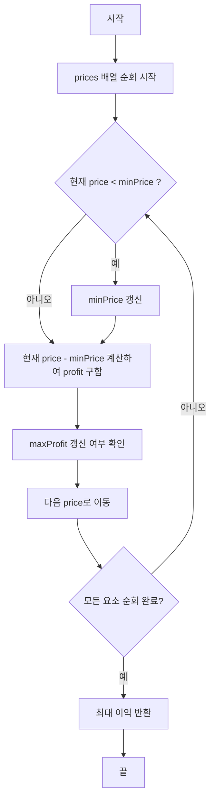

# Chapter 00-00
**LeetCode 121. Best Time to Buy and Sell Stock**

## Table of contents
1. [문제 설명](#1-문제-설명)
1. [문제 접근 방법](#2-문제-접근-방법)
1. [알고리즘 순서도](#3-알고리즘-순서도)
1. [코드](#4-코드)
1. [복잡도 분석](#5-복잡도-분석)
1. [내용 정리](#6-예상-질문)
1. [다른 풀이](#7-다른-풀이-방법)

---

## 1. 문제 설명

```text
You are given an array prices where prices[i] is the price of a given stock on the ith day.

You want to maximize your profit by choosing a single day to buy one stock and choosing a different day in the future to sell that stock.

Return the maximum profit you can achieve from this transaction. If you cannot achieve any profit, return 0.
```

### Constraints:
- `1 <= prices.length <= 10⁵`
- `0 <= prices[i] <= 10⁴`

### 예시

```bash
# Example 1:
Input: prices = [7,1,5,3,6,4]
Output: 5
# Explanation: Buy on day 2 (price = 1) and sell on day 5 (price = 6), profit = 6-1 = 5.
# Note that buying on day 2 and selling on day 1 is not allowed because you must buy before you sell.
```

```bash
# Example 2:
const prices = [2, 4, 1];
Output: 2
```

---

## 2. 문제 접근 방법

### 핵심 아이디어 💡
- 주식은 과거에 사고, 미래에 팔 수 있으므로 현재의 최솟값만 잘 관리하면 됨
- 반복문을 순회하며 최솟값을 저장(최댓값은 저장하지 않음)
  - 현재 값에서 그 최솟값을 뺀 값을 이익으로 계산하여 최대 이익을 계속 갱신

---

## 3. 알고리즘 순서도



### 값의 변화 과정

예시: `prices = [7, 1, 5, 3, 6, 4]`

| Day | Price | minPrice | Current Profit | maxProfit |
|-----|--------|-----------|----------------|------------|
| 0   | 7      | 7         | 0              | 0          |
| 1   | 1      | 1         | 0              | 0          |
| 2   | 5      | 1         | 4              | 4          |
| 3   | 3      | 1         | 2              | 4          |
| 4   | 6      | 1         | 5              | 5          |
| 5   | 4      | 1         | 3              | 5          |
___

## 4. 코드

### Pseudocode

### 풀이 코드

```ts
function maxProfit(prices: number[]): number {
  let minPrice: number = Infinity;
  let maxProfit: number = 0;

  for (let i = 0; i < prices.length; i++) {
    minPrice = Math.min(minPrice, prices[i]);
    maxProfit = Math.max(maxProfit, prices[i] - minPrice);
  }

  return maxProfit;
}
```

---

## 5. 복잡도 분석

### 코드 단위에서 시간 복잡도 및 공간 복잡도 분석

```ts
// TC: O(n)
// SC: O(1) + O(1)
function maxProfit(prices: number[]): number {
  let minPrice: number = Infinity;
  let maxProfit: number = 0;

  for (let i = 0; i < prices.length; i++) {
    minPrice = Math.min(minPrice, prices[i]);
    maxProfit = Math.max(maxProfit, prices[i] - minPrice);
  }

  return maxProfit;
}
```

#### 결과
- TC: O(n)
- SC: O(1)

### 시간 복잡도 ⏳
> 1.	반복문의 실행 횟수를 먼저 보기
> 2.	반복 안에서 실행되는 연산 수를 체크
> 3.	입력의 크기(n)에 따라 얼마나 시간이 늘어나는지 판단

- 반복문은 배열을 한 번만 순회하므로: O(n)
- 각 반복 안에서는 비교 연산만 수행되므로 상수 시간

### 공간 복잡도 🗃️
> 1. 배열, 객체 등 추가적인 자료구조를 새로 만들었는지 보기
> 2. 그 자료구조의 크기가 입력 크기(n)에 비례하는지 체크
> 3. 변수만 사용한 경우는 O(1)로 봄

- 별도의 배열이나 객체 없이 변수만 사용: O(1)
- 자료구조의 크기가 입력 크기(n)에 비례하지 않음

### Big-O 분석 요약
- 평균 시간 복잡도: O(n)
- 최악 시간 복잡도: O(n)
- 공간 복잡도: O(1)

---

## 6. 내용 정리

### 3줄 요약 (Summary)
- 한 번의 반복으로 과거의 최솟값을 저장하며 현재 이익을 계산
- 최댓값이 아닌 최솟값을 저장하는 것이 핵심
- 이익이 최대가 되는 시점을 찾으면 됨

### 이번 문제를 통해 배운 점

### 질문 & 한 줄 답변

---

## 7. 다른 풀이

### 다른 풀이 방법
- 브루트포스 방식: 이중 반복문으로 모든 쌍 비교 (O(n²))

### 다른 풀이 방법을 사용하지 않은 이유
- 시간 복잡도가 비효율적

### 풀이 방법간 비교
| 풀이 방식        | 시간 복잡도  | 공간 복잡도   | 구현 난이도  |
|------------------|--------------|---------------|--------------|
| 브루트포스       | O(n^2)       | O(1)          | 하           |
| 최솟값 갱신 방식 | O(n)         | O(1)          | 하           |
