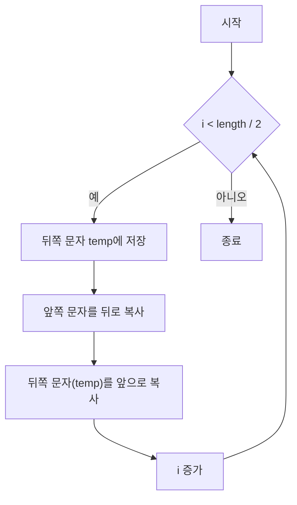

# Chapter 01-02
  LeetCode 344. Reverse String

## Table of contents
1. [문제 설명](#1-문제-설명)
1. [문제 접근 방법](#2-문제-접근-방법)
1. [알고리즘 순서도](#3-알고리즘-순서도)
1. [코드](#4-코드)
1. [복잡도 분석](#5-복잡도-분석)
1. [다른 풀이 방법](#6-다른-풀이-방법)

---

## 1. 문제 설명

```text
Write a function that reverses a string. The input string is given as an array of characters s.

You must do this by modifying the input array in-place with O(1) extra memory.
```

#### Constraints:
- `1 <= s.length <= 10^5`
- `s[i]` is a printable ascii character.

#### 예시
```bash
Input: s = ["h","e","l","l","o"]
Output: ["o","l","l","e","h"]
```


#### 요약
- `1 <= s.length <= 10⁵`
- `s[i]`는 출력 가능한 ASCII 문자
- 새로운 배열 생성 안됨 (in-place 수정)
- 추가 메모리 사용 O(1)만 가능

---

## 2. 문제 접근 방법

### 핵심 아이디어
1. 배열의 앞쪽 절반만 순회하면 됨, 배열의 길이만큼 순회할 필요 없음 (중간 이후를 계속 순회하면 원래 배열이 됨)
1.  문자열은 배열로 표현되므로, 양쪽에서 서로 교환(swap)하는 방식으로 뒤집을 수 있음, 현재 요소와 대칭되는 끝 요소를 교환
1.  한 번의 루프에서 앞과 뒤 값을 교환하면 O(n) 시간에 해결 가능

---

## 3. 알고리즘 순서도


___

## 4. 코드

- in-place 방식

```ts
function reverseString(s: string[]): void {
  let temp = '';
  for (let i = 0; i < s.length / 2; i++) {
    // 현재 요소와 대칭되는 끝 요소를 교환
    temp = s[s.length - (i + 1)]; // o, l, l, l, o
    s[s.length - (i + 1)] = s[i]; // h, e, l, e, h 끝 요소 자리에 할당
    s[i] = temp; // 앞 요소 자리부터 할당
  }
}
```

### 반복문 순회 시 값의 변화

```bash
첫 번째 순회: ["h","e","l","l","o"] -> ["o","e","l","l","h"]
두 번째 순회: ["o","e","l","l","h"] -> ["o","l","l","e","h"]
세 번째 순회: ["o","l","l","e","h"] -> ["o","l","l","e","h"]
```

중간 이후 지점 반복문을 계속 실행하면 원래 배열이 됨
> 뒤집기 연산은 대칭적이기 때문에, 전체 길이만큼 swap을 진행하면 결국 두 번 뒤집은 것과 동일하게 되어 원래 배열이 됨

```bash
// ====== 배열의 길이 중간 이후를 순회하는 경우 ======
// 네 번째 순회:   ["o","l","l","e","h"] -> ["o","e","l","l","h"]
// 다섯 번째 순회: ["o","e","l","l","h"] -> ["h","e","l","l","o"]
```

---

## 5. 복잡도 분석

### 시간 복잡도
> 1.	반복문의 실행 횟수를 먼저 보기
> 2.	반복 안에서 실행되는 연산 수를 체크
> 3.	입력의 크기(n)에 따라 얼마나 시간이 늘어나는지 판단

- 길이는 `s.length / 2` 이므로 약 `n/2`회 반복됨
- 루프 내에는 상수 시간 연산(swap) 3개 있음
- 따라서 전체 반복 시간은 O(n/2)이며, 상수 계수를 생략하면 O(n)이 됨

**결론: 시간 복잡도: O(n)**

> 연산이 복잡해지는 경우가 무엇인지에 대한 고민

### 공간 복잡도
> 1. 배열, 객체 등 추가적인 자료구조를 새로 만들었는지 보기
> 2. 그 자료구조의 크기가 입력 크기(n)에 비례하는지 체크
> 3. 변수만 사용한 경우는 O(1)로 봄

- 코드에서 `temp`라는 문자열 변수 하나만 선언
- 배열을 새로 만들지 않았고, in-place로 수정
- 입력 크기에 따라 늘어나는 추가 메모리 없음

**결론: 공간 복잡도: O(1)**

### Big-O 분석 요약
- 평균적인 경우 시간 복잡도: O(n)
- 최악의 경우 시간 복잡도: O(n)
- 공간 복잡도: O(1)


## 6. 다른 풀이 방법
- `swap`에 `temp`를 사용하는 방식은 이해하기 쉽지만, 구조분해 할당 방식은 더 현대적임

```ts
[s[i], s[s.length - 1 - i]] = [s[s.length - 1 - i], s[i]];
```

> `temp`를 쓰는 방식은 코드량이 증가하고 단계적이지만, 구조분해 할당 방식은 간결하고 최근 자바스크립트 스타일에 부합
