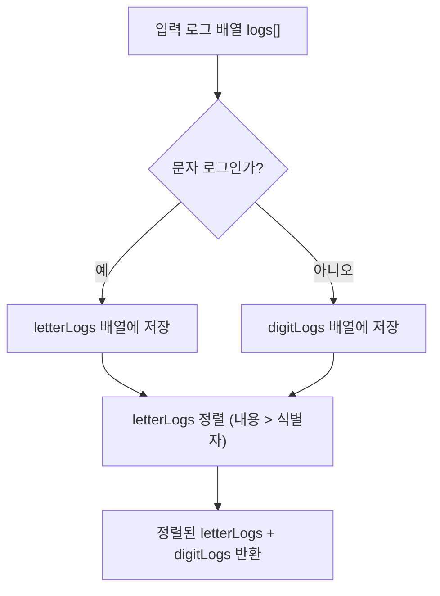

# Chapter 01-03
**LeetCode 937. Reorder Data in Log Files**

## Table of contents
1. [문제 설명](#1-문제-설명)
1. [문제 접근 방법](#2-문제-접근-방법)
1. [알고리즘 순서도](#3-알고리즘-순서도)
1. [코드](#4-코드)
1. [복잡도 분석](#5-복잡도-분석)
1. [다른 풀이 방법](#6-다른-풀이-방법)

---

## 1. 문제 설명

```text
You are given an array of logs. Each log is a space-delimited string of words, where the first word is the identifier.

There are two types of logs:

Letter-logs: All words (except the identifier) consist of lowercase English letters.
Digit-logs: All words (except the identifier) consist of digits.
Reorder these logs so that:

The letter-logs come before all digit-logs.
The letter-logs are sorted lexicographically by their contents. If their contents are the same, then sort them lexicographically by their identifiers.
The digit-logs maintain their relative ordering.
Return the final order of the logs.
```

#### Constraints:
- `1 <= logs.length <= 100`
- `3 <= logs[i].length <= 100`
- All the tokens of `logs[i]` are separated by a single space.
- `logs[i]` is guaranteed to have an identifier and at least one word after the identifier.

#### 예시

```bash
Input:
logs = [
  "dig1 8 1 5 1",
  "let1 art can",
  "dig2 3 6",
  "let2 own kit dig",
  "let3 art zero"
]

---

Output:
[
  "let1 art can",
  "let3 art zero",
  "let2 own kit dig",
  "dig1 8 1 5 1",
  "dig2 3 6"
]
```

### 문제 정리

```bash
# 로그의 구성
<identifier> <content>

# identifier: 영문 소문자 or 숫자로 구성된 고유 식별자
# content: 영문 소문자 또는 숫자로 구성된 단어들 (공백으로 구분)
```


> 1. 모든 문자 로그는 숫자 로그보다 앞에 와야 함
> 2. 문자 로그는 다음의 우선순위로 정렬해야 함:
>   - content 기준으로 사전 순
>   - 만약 content가 같다면, identifier 기준으로 사전 순
> 3. 숫자 로그는 입력 순서를 그대로 유지해야 함


---

## 2. 문제 접근 방법

### 핵심 아이디어
1. 각 로그를 문자 로그와 숫자 로그로 구분
1. 문자 로그는 `내용(content)` → `식별자(identifier)` 순으로 정렬
1. 숫자 로그는 원래의 순서 유지
1. 최종적으로 문자 로그에 숫자 로그를 이어 붙임

---

## 3. 알고리즘 순서도


___

## 4. 코드

### 문자 로그와 숫자 로그로 구분

```ts
function isDigitLog(log: string) {
  const [id, ...rest] = log.split(' ');
  return /\d/.test(rest[0]);
}

// ---

function reorderLogFiles(logs: string[]): string[] {
  for (const log of logs) {
    if (isDigitLog(log)) {
      digitLogs.push(log); // 숫자로 시작하면 숫자 로그
    } else {
      letterLogs.push(log); // 문자가 시작이면 문자 로그
    }
  }

  // ...
}
```

### 문자 로그는 content와 식별자로 나눠 정렬

#### 사전순 비교를 위해 localeCompare() 활용
`localeCompare()`는 자바스크립트 문자열 비교 함수

```ts
'apple'.localeCompare('banana'); // -1 (apple < banana)
'banana'.localeCompare('apple'); // 1  (banana > apple)
'apple'.localeCompare('apple');  // 0  (같음)
```

```ts
letterLogs.sort((a, b) => {
  // 각 로그를 공백 기준으로 나눔
  const [idA, ...restA] = a.split(' '); // 예: "let1 art can" => idA = "let1", restA = ["art", "can"]
  const [idB, ...restB] = b.split(' '); // 예: "let2 own kit" => idB = "let2", restB = ["own", "kit"]

  const contentA = restA.join(' ');
  const contentB = restB.join(' ');

  // 1. content가 같으면 id를 사전순으로 비교
  if (contentA === contentB) {
    return idA.localeCompare(idB);
    // 예: "let1" < "let2" → -1 반환 → a가 앞에 오도록
  }
  
  // 2. content끼리 사전 순 비교
  return contentA.localeCompare(contentB);
  // 예: "art can" < "own kit" → -1 반환 → a가 앞에 오도록
});
```

---

## 5. 복잡도 분석

### 시간 복잡도 ⏳
> 1.	반복문의 실행 횟수를 먼저 보기
> 2.	반복 안에서 실행되는 연산 수를 체크
> 3.	입력의 크기(n)에 따라 얼마나 시간이 늘어나는지 판단

#### 로그 분류
문자 로그와 숫자 로그로 구분하는 부분 시간 복잡도 분석
- `logs.length = N`이라면, 이 반복문은 N번 실행
- 각 `log.split(' ')`는 평균적으로 K개의 단어를 나누는데, 최대 길이가 100이라 상수로 간주 → O(1)
- `/\d/.test(rest[0])` 도 O(1)

**이 부분 시간 복잡도**: O(N)

#### 문자 로그 정렬
문자 로그를 `내용(content)` → `식별자(identifier)` 순으로 정렬하는 부분 시간 복잡도 분석

- `letterLogs.length = L`이라 하자 (L ≤ N)
- 정렬 자체는 일반적으로 O(L log L)
  - JavaScript의 sort는 TimSort 기반: 평균/최악 O(N log N)
- 다만 비교 함수 안에서:
  - split(' '): O(K)
  - join(' '): O(K)
  - localeCompare: 두 문자열의 길이 = 최대 100 → O(K)
  - 그래서 **한 번의 비교 연산은 O(K)** (K는 한 log의 평균 단어 수 또는 길이)

**이 부분 시간 복잡도**: O(N log N)  

#### 요약
> 전체 정렬 복잡도: O(L log L × K)
> - 그런데 K는 최대 100이므로 → O(L log L)
> - 즉, O(N log N)

**시간 복잡도**: O(N log N)

### 공간 복잡도 🗃️
> 1. 배열, 객체 등 추가적인 자료구조를 새로 만들었는지 보기
> 2. 그 자료구조의 크기가 입력 크기(n)에 비례하는지 체크
> 3. 변수만 사용한 경우는 O(1)로 봄

#### 추가 배열의 사용

```ts
const letterLogs: string[] = [];
const digitLogs: string[] = [];
```

- 총 N개의 로그를 2개의 배열로 나눠 저장함
- letterLogs + digitLogs = N
- 각 로그는 string이므로 → O(N)

**공간 복잡도**: O(N)

### Big-O 분석 요약
- 평균 시간 복잡도: O(N log N)
- 최악 시간 복잡도: O(N log N)
- 공간 복잡도: O(N)

---

## 6. 다른 풀이 방법

- `String.prototype.indexOf()`의 사용
