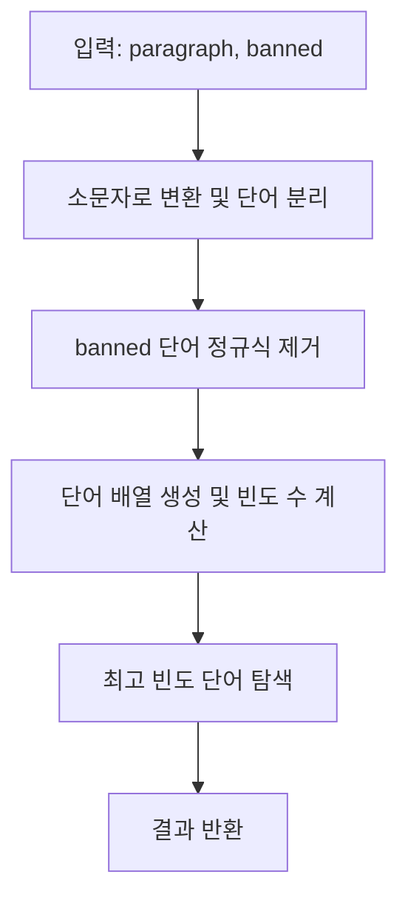

# Chapter 00-00

**LeetCode 819. Most Common Word**

## Table of contents
1. [문제 설명](#1-문제-설명)
1. [문제 접근 방법](#2-문제-접근-방법)
1. [알고리즘 순서도](#3-알고리즘-순서도)
1. [코드](#4-코드)
1. [복잡도 분석](#5-복잡도-분석)
1. [다른 풀이 방법](#6-다른-풀이-방법)

---

## 1. 문제 설명

```text
Given a string paragraph and a string array of the banned words banned, return the most frequent word that is not banned. It is guaranteed there is at least one word that is not banned, and that the answer is unique.

The words in paragraph are case-insensitive and the answer should be returned in lowercase.
```

### Constraints:
- 1 <= paragraph.length <= 1000
- paragraph consists of English letters, space ' ', or one of the symbols: "!?',;.".
- 0 <= banned.length <= 100
- 1 <= banned[i].length <= 10
- banned[i] consists of only lowercase English letters.

### 예시

```bash
Input: paragraph = "Bob hit a ball, the hit BALL flew far after it was hit.", banned = ["hit"]
Output: "ball"
Explanation: 
"hit" occurs 3 times, but it is a banned word.
"ball" occurs twice (and no other word does), so it is the most frequent non-banned word in the paragraph. 
Note that words in the paragraph are not case sensitive,
that punctuation is ignored (even if adjacent to words, such as "ball,"), 
and that "hit" isn't the answer even though it occurs more because it is banned.
```

---

## 2. 문제 접근 방법

### 핵심 아이디어 💡
- 문장을 소문자로 변환하고 정규표현식으로 단어만 추출
- banned 단어를 정규표현식으로 제거
- 단어별 등장 횟수를 카운팅하고, 가장 많이 등장한 단어를 반환

---

## 3. 알고리즘 순서도


___

## 4. 코드

```ts

```

### 값의 변화 과정
```md
Input: "Bob hit a ball, the hit BALL flew far after it was hit."
banned: ["hit"]

Step 1: 소문자 변환 및 정규식 처리 → "bob hit a ball the hit ball flew far after it was hit"
Step 2: banned 제거 → "bob   a ball the   ball flew far after it was "
Step 3: 단어 배열 → ["bob", "a", "ball", "the", "ball", "flew", "far", "after", "it", "was"]
Step 4: 빈도 수 계산 → {"bob":1, "a":1, "ball":2, "the":1, ...}
Step 5: 결과 → "ball"
```

---

## 5. 복잡도 분석

### 시간 복잡도 ⏳
> 1.	반복문의 실행 횟수를 먼저 보기
> 2.	반복 안에서 실행되는 연산 수를 체크
> 3.	입력의 크기(n)에 따라 얼마나 시간이 늘어나는지 판단

- 정규표현식 처리를 포함한 문자열 탐색: O(N)
- 단어 빈도 수 집계: O(N)
- 최빈 단어 탐색: O(M) (M = 서로 다른 단어 개수)
→ 전체 시간 복잡도: O(N)

### 공간 복잡도 🗃️
> 1. 배열, 객체 등 추가적인 자료구조를 새로 만들었는지 보기
> 2. 그 자료구조의 크기가 입력 크기(n)에 비례하는지 체크
> 3. 변수만 사용한 경우는 O(1)로 봄

- 단어별 등장 횟수를 저장하는 객체 사용 → O(M)
- 입력 길이에 비례하지 않는 추가 구조 → O(1) 아님

### Big-O 분석 요약
- 평균 시간 복잡도: O(N)
- 최악 시간 복잡도: O(N)
- 공간 복잡도:

---

## 6. 다른 풀이 방법

예외 처리 추가 예시

```ts
if (!paragraph) return '';
if (!banned || banned.length === 0) return words[0]; // 첫 단어라도 반환
```


- 내장 메소드의 시간복잡도에 대해 이해가 필요하다
- 지배항을 찾아야 함
- 어떤 값으로 치환해야 할지 찾아야 함
- 결국은 증가량에 관련된 이야기임
- 다른 애들이 종속적이어서, 