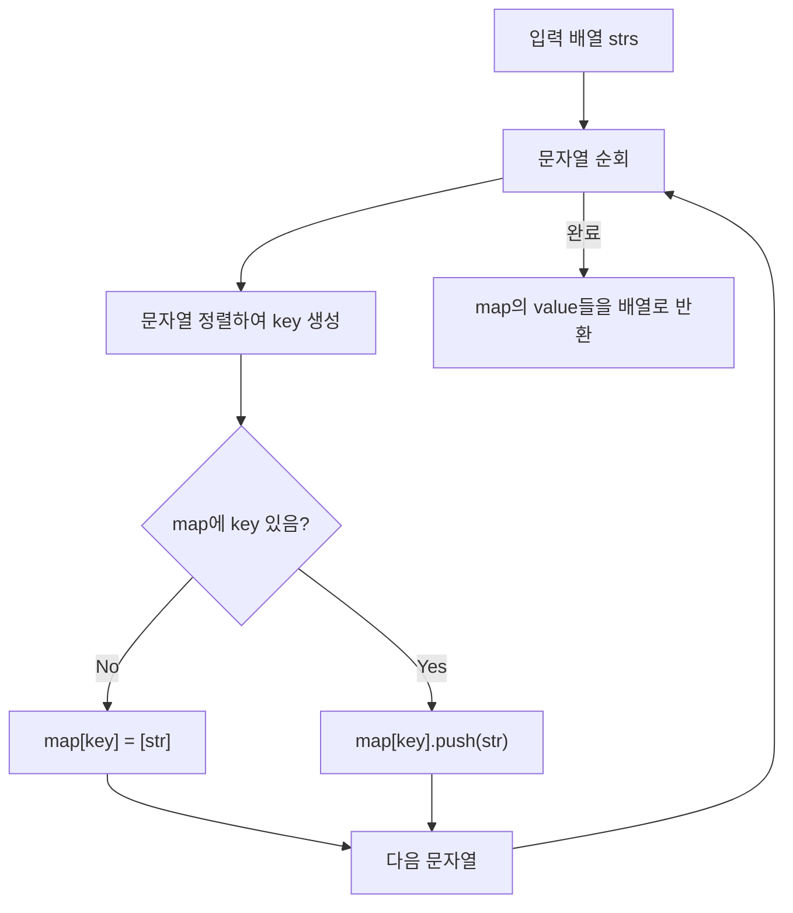

# Chapter 01-05
**LeetCode 49. Group Anagrams**

## Table of contents
1. [문제 설명](#1-문제-설명)
1. [문제 접근 방법](#2-문제-접근-방법)
1. [알고리즘 순서도](#3-알고리즘-순서도)
1. [코드](#4-코드)
1. [복잡도 분석](#5-복잡도-분석)
1. [질문](#6-질문)
1. [다른 풀이 방법](#7-다른-풀이-방법)

---

## 1. 문제 설명

```text
Given an array of strings strs, group the anagrams together. You can return the answer in any order.

Explanation:
- There is no string in strs that can be rearranged to form "bat".
- The strings "nat" and "tan" are anagrams as they can be rearranged to form each other.
- The strings "ate", "eat", and "tea" are anagrams as they can be rearranged to form each other.
```

### Constraints:
- `1 <= strs.length <= 104`
- `0 <= strs[i].length <= 100`
- `strs[i]` consists of lowercase English letters.

### 예시

```bash
Input: strs = ["eat","tea","tan","ate","nat","bat"]

Output: [["bat"],["nat","tan"],["ate","eat","tea"]]
```

### 문제 이해
- Anagram (애너그램):  
  - 한 단어나 어구에 있는 단어 철자들의 순서를 바꾸어 원래의 의미와 논리적으로 연관이 있는 다른 단어 또는 어구를 만드는 일
  - 단어의 철자만 바뀐 경우 → 'eat', 'tea', 'ate'는 모두 같은 철자 조합 (aet)
- 정렬 후 비교 or 문자 빈도 카운팅 필요

---

## 2. 문제 접근 방법

### 핵심 아이디어 💡
1. 빈 map 만들기:  
  a. Map 자료구조를 사용해서 같은 그룹에 해당하는 문자열 모으기  
  b. (key: 정렬된 문자열, value: 애너그램 그룹 배열)
2. 입력 배열 strs를 순회하면서:  
  a. 각 문자열을 정렬해서 key로 만듦  
  b. 해당 key가 map에 없다면 빈 배열로 초기화  
  c. 현재 문자열을 해당 key의 배열에 추가
3. map의 모든 value를 배열로 반환

---

## 3. 알고리즘 순서도


___

## 4. 코드

```ts

```

### 값의 변화 과정

예시 입력

```ts
const strs = ['eat', 'tea', 'tan', 'ate', 'nat', 'bat'];
```

| 반복 | 현재 문자열 | 정렬된 key | map 상태 요약 |
|------|--------------|-------------|----------------|
| 1    | 'eat'        | 'aet'       | { 'aet': ['eat'] } |
| 2    | 'tea'        | 'aet'       | { 'aet': ['eat', 'tea'] } |
| 3    | 'tan'        | 'ant'       | { 'aet': ['eat', 'tea'], 'ant': ['tan'] } |
| 4    | 'ate'        | 'aet'       | { 'aet': ['eat', 'tea', 'ate'], 'ant': ['tan'] } |
| 5    | 'nat'        | 'ant'       | { 'aet': [...], 'ant': ['tan', 'nat'] } |
| 6    | 'bat'        | 'abt'       | { 'aet': [...], 'ant': [...], 'abt': ['bat'] } |

- 문자열이 정렬되어 key로 쓰이고, 해당 key의 배열에 문자열이 추가됨
- map 객체는 애너그램 그룹을 key-value 형태로 구성함

---

## 5. 복잡도 분석

### 시간 복잡도 ⏳
> 1.	반복문의 실행 횟수를 먼저 보기
> 2.	반복 안에서 실행되는 연산 수를 체크
> 3.	입력의 크기(n)에 따라 얼마나 시간이 늘어나는지 판단

- 반복문의 핵심 연산은 정렬
  - 문자열 정렬: 각 문자열은 길이 k → `.split('').sort().join('')` = O(k log k)
  - 문자열이 n개 있으므로 전체 반복: O(n * k log k)
  - 로그-선형 시간이 문자열 n개만큼 반복
  - `split` + `sort` + `join` = O(k log k)이 n번 → 시간복잡도: **O(n * k log k)**
- 해시맵 접근 및 삽입: O(1) (평균)

#### 지배항 판단
- `sort()`가 가장 높은 비용을 유발 → O(k log k)

### 공간 복잡도 🗃️
> 1. 배열, 객체 등 추가적인 자료구조를 새로 만들었는지 보기
> 2. 그 자료구조의 크기가 입력 크기(n)에 비례하는지 체크
> 3. 변수만 사용한 경우는 O(1)로 봄

그룹화된 애너그램을 저장하는 `map`의 크기에 비례
- 해시맵(`map: { [key: string]: string[] }`)을 사용하여 n개의 그룹을 저장
- 각 문자열 길이 k만큼 평균적으로 저장
- 전체 문자열 수와 길이에 비례 → 공간복잡도: **O(n * k)**

### Big-O 분석 요약
- 평균 시간 복잡도: O(N * K log K)
- 최악 시간 복잡도: O(N * K log K)
- 공간 복잡도: O(N * K)

---

## 6. 질문
1. split().sort().join()이 왜 O(k log k)인가요?
    - sort()는 비교 기반 정렬이기 때문 (브라우저 구현에 따라 다를 수 있음)
2. 전체 시간복잡도가 O(n * k log k)인 이유는?
    - n개의 문자열에 대해 매번 정렬하기 때문
3.	해시맵의 접근/삽입은 시간복잡도에 어떻게 기여하나요?
    - 평균적으로 O(1), 해시 충돌이 적은 이상 효율적
4.	공간 복잡도는 왜 O(nk)로 표현되는가?
    - 모든 문자열을 키-값 쌍으로 저장하고, 각 키는 최대 k글자의 문자열을 가진다

---

## 7. 다른 풀이 방법

### 코드 피드백
- 조건문 간소화
  - 삼항연산자 및 조건문 처리로 구문 줄이기 가능
- forEach 또는 for...of로 더 간결한 표현 가능
