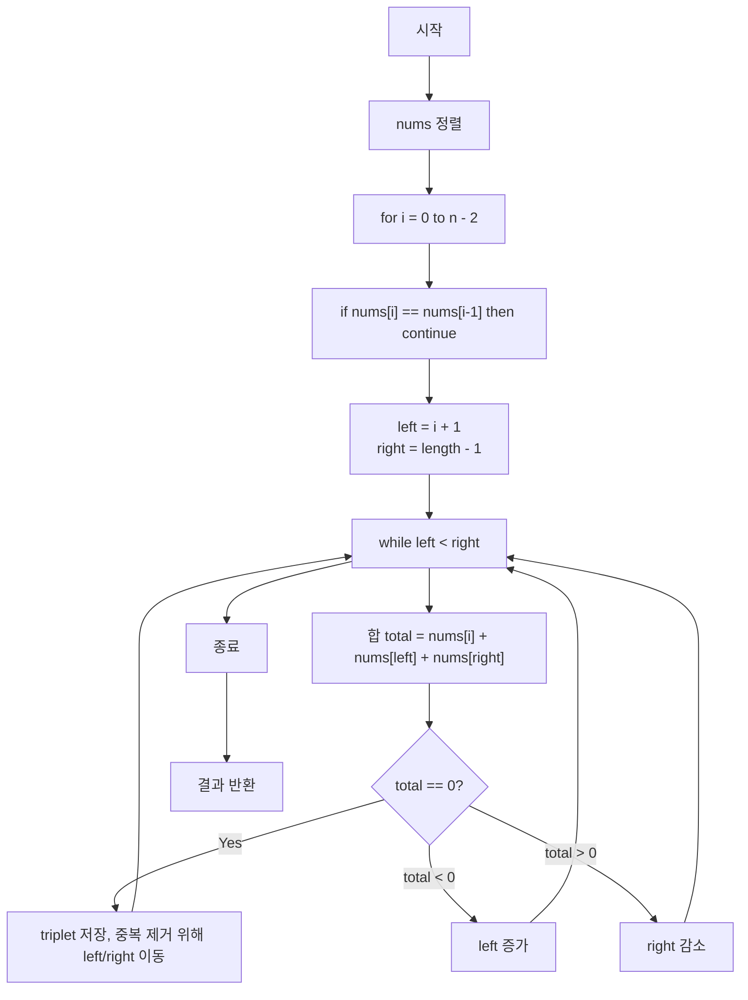

# Chapter 01-09
**LeetCode 15. 3 Sum**

## Table of contents
1. [문제 설명](#1-문제-설명)
1. [문제 접근 방법](#2-문제-접근-방법)
1. [알고리즘 순서도](#3-알고리즘-순서도)
1. [코드](#4-코드)
1. [복잡도 분석](#5-복잡도-분석)
1. [내용 정리](#6-예상-질문)
1. [다른 풀이](#7-다른-풀이-방법)

---

## 1. 문제 설명
Given an integer array nums, return all the triplets `[nums[i], nums[j], nums[k]]` such that `i != j`, `i != k`, and `j != k`, and `nums[i] + nums[j] + nums[k] == 0`.  

Notice that the solution set must not contain duplicate triplets.

### Constraints:
- `3 <= nums.length <= 3000`
- `-10^5 <= nums[i] <= 10^5`

### 예시
```bash
# Example 1:
Input: nums = [-1,0,1,2,-1,-4]
Output: [[-1,-1,2],[-1,0,1]]
Explanation: 
nums[0] + nums[1] + nums[2] = (-1) + 0 + 1 = 0.
nums[1] + nums[2] + nums[4] = 0 + 1 + (-1) = 0.
nums[0] + nums[3] + nums[4] = (-1) + 2 + (-1) = 0.

---

The distinct triplets are [-1,0,1] and [-1,-1,2].
Notice that the order of the output and the order of the triplets does not matter.
```

```bash
# Example 2:
Input: nums = [0,0,0]
Output: [[0,0,0]]
Explanation: The only possible triplet sums up to 0.
```

### Hint
- So, we essentially need to find three numbers x, y, and z such that they add up to the given value. If we fix one of the numbers say x, we are left with the two-sum problem at hand!
- For the two-sum problem, if we fix one of the numbers, say x, we have to scan the entire array to find the next number y, which is value - x where value is the input parameter. Can we change our array somehow so that this search becomes faster?
- The second train of thought for two-sum is, without changing the array, can we use additional space somehow? Like maybe a hash map to speed up the search?

---

## 2. 문제 접근 방법

### 핵심 아이디어 💡
- **정렬**, 배열을 정렬하면 중복 제거나 투 포인터 전략을 적용하기 용이함
- **투 포인터 전략**
  - 정렬된 배열에서 특정 인덱스를 기준으로, 나머지 두 수를 양쪽 끝에서 가운데로 좁혀가며 세 수의 합 0 찾기
  - 세 수의 합이 0보다 크면 오른쪽 포인터를 줄이고, 작으면 왼쪽 포인터를 늘리는 식으로 탐색
- **중복 제거**
  - `nums` 안에 같은 값이 있을 수 있기 때문에, 결과에 중복된 triplet이 포함되지 않도록 해야 함
  - 같은 수가 연속될 때는 스킵


---

## 3. 알고리즘 순서도



### 값의 변화 과정

#### i = 0일 때
```bash
nums = [-4, -1, -1, 0, 1, 2]  // 정렬된 상태
```

`i = 0` (`nums[i] = -4`) 일 때 변화 과정:

| left | right  | nums[left]  | nums[right]   | total  | 조치               |
|------|--------|-------------|---------------|--------|--------------------|
| 1    | 5      | -1          | 2             | -3     | total < 0 → left++ |
| 2    | 5      | -1          | 2             | -3     | total < 0 → left++ |
| 3    | 5      | 0           | 2             | -2     | total < 0 → left++ |
| 4    | 5      | 1           | 2             | -1     | total < 0 → left++ |
| 5    | 5      | 2           | 2             | 0      | while 탈출         |


#### i = 1일 때
```bash
nums = [-4, -1, -1, 0, 1, 2]  // 정렬된 상태
```
`i = 1` (`nums[i] = -1`) 일 때 변화 과정:

| left | right | nums[left] | nums[right] | total | 조치                            |
|------|--------|-------------|---------------|--------|---------------------------------|
| 2    | 5      | -1          | 2             | 0      | 정답 발견! [-1, -1, 2]          |
|      |        |             |               |        | 중복 체크 → left++, right--     |
| 3    | 4      | 0           | 1             | 0      | 정답 발견! [-1, 0, 1]           |
|      |        |             |               |        | left++, right-- → left=4, right=3 |
|      |        |             |               |        | 종료 (left ≥ right)             |

___

## 4. 코드

### Pseudocode

```plaintext
Given an array nums sorted in ascending order
Given a target sum

twoSum(nums, target):
  L = 0
  R = nums.length - 1

  while L < R:
    total = nums[L] + nums[R]

    if total == target:
      return [L, R]  // found the pair

    else if total < target:
      L = L + 1  // need a bigger number

    else:
      R = R - 1  // need a smaller number

  return null  // no pair found
```

### 풀이 코드

```ts
function threeSum(nums: number[]): number[][] {
  nums.sort((a, b) => a - b);

  const result: number[][] = [];

  for (let i = 0; i < nums.length - 2; i++) {
    if (i > 0 && nums[i] === nums[i - 1]) {
      // i > 0일 때 nums[i] === nums[i - 1]이면 반복문을 건너뛰어야 중복된 triplet이 결과에 안 들어가게 됨
      continue;
    }

    let left = i + 1;
    let right = nums.length - 1;

    while (left < right) {
      const total = nums[i] + nums[left] + nums[right];

      if (total === 0) {
        result.push([nums[i], nums[left], nums[right]]);

        while (left < right && nums[left] === nums[left + 1]) {
          left = left + 1;
        }

        while (left < right && nums[right] === nums[right - 1]) {
          right = right - 1;
        }

        left = left + 1;
        right = right - 1;
      } else if (total < 0) {
        left = left + 1;
      } else {
        right = right - 1;
      }
    }
  }

  return result;
}
```

---

## 5. 복잡도 분석

### 코드 분석
- TC: O(n log n) + O(n²), 지배항은 O(n²)
- SC: O(1) + O(1) + O(1) + O(n²)

```ts
function threeSum(nums: number[]): number[][] {
  // TC: O(n log n)
  // SC: O(1), (제자리 정렬 sort()는 내부적으로 일부 공간 쓰지만 O(1) 보장)
  nums.sort((a, b) => a - b); 

  const result: number[][] = []; // SC: 최대 O(n²)개의 결과가 저장될 수 있음. 그러나 이는 출력에 포함되므로 제외 가능

  // TC: O(n²)
  for (let i = 0; i < nums.length - 2; i++) { // TC: O(n)
    if (i > 0 && nums[i] === nums[i - 1]) {
      // i > 0일 때 nums[i] === nums[i - 1]이면 반복문을 건너뛰어야 중복된 triplet이 결과에 안 들어가게 됨
      continue;
    }

    // SC: O(1), 포인터 변수(left, right) 
    let left = i + 1;
    let right = nums.length - 1;

  
    while (left < right) { // TC: O(n), 내부 while 루프는 각 i마다 최대 n번 수행 가능
      const total = nums[i] + nums[left] + nums[right];

      if (total === 0) {
        result.push([nums[i], nums[left], nums[right]]); // SC: O(1) 내장 메서드 시간 복잡도

        while (left < right && nums[left] === nums[left + 1]) {
          left = left + 1;
        }

        while (left < right && nums[right] === nums[right - 1]) {
          right = right - 1;
        }

        left = left + 1;
        right = right - 1;
      } else if (total < 0) {
        left = left + 1;
      } else {
        right = right - 1;
      }
    }
  }

  return result;
}
```

### 시간 복잡도 ⏳
> 1.	반복문의 실행 횟수를 먼저 보기
> 2.	반복 안에서 실행되는 연산 수를 체크
> 3.	입력의 크기(n)에 따라 얼마나 시간이 늘어나는지 판단

- 외부 for문은 n번 반복
- 내부 while문은 각 i에 대해 최대 n번까지 줄어들 수 있으므로 전체적으로 O(n^2)

### 공간 복잡도 🗃️
> 1. 배열, 객체 등 추가적인 자료구조를 새로 만들었는지 보기
> 2. 그 자료구조의 크기가 입력 크기(n)에 비례하는지 체크
> 3. 변수만 사용한 경우는 O(1)로 봄

- 추가 배열(result) 외에는 포인터 변수만 사용
- 공간 복잡도는 O(1) (결과 배열 제외)

### Big-O 분석 요약
- 평균 시간 복잡도: O(n^2)
- 최악 시간 복잡도: O(n^2)
- 공간 복잡도: O(1)

---

## 6. 내용 정리

### 3줄 요약 (Summary)
- 정렬된 배열을 기반으로 세 수의 합이 0이 되는 조합을 탐색
- i를 기준으로 두 포인터를 활용해 효율적으로 조합을 찾음
- 중복된 조합은 while 루프로 제거하여 유일한 결과만 반환함

### 이번 문제를 통해 배운 점
- 투 포인터 전략의 적용 방식과 정렬의 이점을 체득
- 중복된 조합을 제거하기 위해 포인터 이동에 while 조건이 필요하다는 것을 학습

### 질문 & 한 줄 답변
Q. 중복된 triplet이 생기는 이유는 무엇인가요?  
A. `i`, `left`, `right` 포인터가 같은 값을 반복적으로 탐색할 경우 중복된 조합이 생기며, 이를 `while` 문으로 건너뛰어야 방지 가능

```bash
# Input: 
nums: [-2, 0, 3, -1, 4, 0, 3, 4, 1, 1, 1, -3, -5, 4, 0]

# 정렬 후
nums: [-5, -3, -2, -1, 0, 0, 0, 1, 1, 1, 3, 3, 4, 4, 4]
```


Q2. for 루프는 왜 `i < nums.length - 2`까지만 탐색해도 충분한가?  
A2. threeSum 문제는 3개의 수를 골라야 하기 때문, 따라서 i는 마지막에서 두 번째 수까지만 순회하면 충분하고, 그보다 더 뒤는 **의미 없는 순회가 됨**
- i가 배열의 끝에서 두 번째나 마지막에 위치하면, left = i + 1, right = nums.length - 1이 됨
- 이 경우 left와 right가 겹치거나 넘어서게 됨 → 투 포인터 로직이 작동할 수 없음

```bash
nums.length = 6 이면

for (i = 0; i < (6 - 2 = 4); i++) # i는 최대 3까지 가능
```


| i | left | right | 조합 가능?            |
|---|------|-------|------------------------|
| 0 | 1    | 5     | ✅ 가능                |
| 1 | 2    | 5     | ✅ 가능                |
| 2 | 3    | 5     | ✅ 가능                |
| 3 | 4    | 5     | ✅ 가능                |
| 4 | 5    | 5     | ❌ left = right        |
| 5 | 6    | 5     | ❌ left > right        |


---

## 7. 다른 풀이

### 다른 풀이 방법

### 다른 풀이 방법을 사용하지 않은 이유

### 풀이 방법간 비교
| 풀이 방식        | 시간 복잡도  | 공간 복잡도   | 구현 난이도  |
|------------------|--------------|---------------|--------------|
| 정렬 + 투 포인터 | O(n^2)       | O(1)          | 중           |
