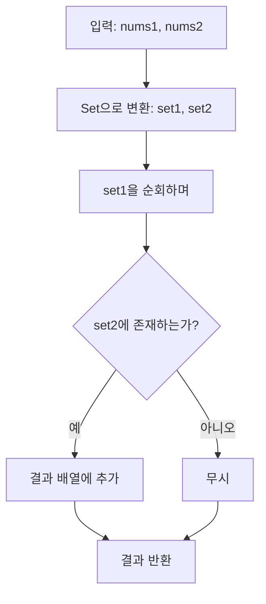

# Chapter 00-00
**LeetCode (Number). Title**

## Table of contents
1. [문제 설명](#1-문제-설명)
1. [문제 접근 방법](#2-문제-접근-방법)
1. [알고리즘 순서도](#3-알고리즘-순서도)
1. [코드](#4-코드)
1. [복잡도 분석](#5-복잡도-분석)
1. [예상 질문](#6-예상-질문)
1. [다른 풀이 방법](#7-다른-풀이-방법)

---

## 1. 문제 설명

```text
Given two integer arrays nums1 and nums2, return an array of their intersection. Each element in the result must be unique and you may return the result in any order.
```

### Constraints:
- `1 <= nums1.length, nums2.length <= 1000`
- `0 <= nums1[i], nums2[i] <= 1000`

### 예시

```bash
# Example 1:
Input: nums1 = [1,2,2,1], nums2 = [2,2]
Output: [2]

# Example 2:
Input: nums1 = [4,9,5], nums2 = [9,4,9,8,4]
Output: [9,4]
# Explanation: [4,9] is also accepted.
```

---

## 2. 문제 접근 방법

### 핵심 아이디어 💡
1. 입력 받은 두 개 배열을 순회하며, 공통 요소를 찾아야 함
2. Set 자료구조를 사용하면 중복 제거와 탐색이 효율적

---

## 3. 알고리즘 순서도



### 값의 변화 과정

입력: nums1 = [1,2,2,1], nums2 = [2,2]

| 단계 | set1 생성 결과 | set2 생성 결과 | 현재 비교 대상 | set2에 존재?  | result 배열 변화 |
|------|----------------|----------------|----------------|---------------|------------------|
| 1    | {1, 2}         | {2}            | 1              | ❌            | []               |
| 2    | {1, 2}         | {2}            | 2              | ✅            | [2]              |

___

## 4. 코드

### Pseudocode

```plaintext
Given two arrays nums1 and nums2

intersection(nums1, nums2):
  set1 = Set(nums1)         // 중복 제거된 첫 번째 배열
  set2 = Set(nums2)         // 중복 제거된 두 번째 배열
  result = []

  for num in set1:
    if num in set2:
      result.append(num)

  return result
```

### 풀이 코드 분석

#### Time Complexity
- Time Complexity = O(2n) + O(m) + O(1) + O(1)

```ts
function intersection(nums1: number[], nums2: number[]): number[] {
  const result: number[] = [];  
  const set1 = new Set(nums1); // O(n)
  const set2 = new Set(nums2); // O(m)

  //  O(n * (O(1) + O(1)))
  for (const num of set1) { // O(n)
    if (set2.has(num)) { // O(1)
      result.push(num); // O(1)
    }
  }

  return result;
}
```

> 빅오 표기법에서는 최고차항 이외는 버림(1). 그리고 최고차항의 계수는 무시(2)
> - **중복 선형시간**, 즉 작은 상수나 중복된 선형 시간(O(n) + O(n))은 결국 O(n)으로 표현 <-- (2)
> - O(1) 두 개는 반복문 안에서 상수 시간 연산이므로 반복 횟수에 따라 누적됨. 하지만 `for` 루프가 `set1`에 대해서만 수행되므로 O(n) 안에 포함

#### Space Complexity
- Space Complexity = O(n) + O(m)

```ts
function intersection(nums1: number[], nums2: number[]): number[] {
  const result: number[] = [];  
  const set1 = new Set(nums1); // O(n)
  const set2 = new Set(nums2); // O(m)
  
  for (const num of set1) { 
    if (set2.has(num)) {
      result.push(num);
    }
  }

  return result;
}
```

> Set(nums1)은 최대 nums1.length 크기 → O(n), Set(nums2)도 최대 nums2.length 크기 → O(m)
> 결과(result) 배열은 중복 없이 교집합 원소만 담기 때문에 최대 O(min(n, m))
> 빅오 표기법에서는 가장 영향이 큰 항(최고 차항)만 남기므로 → **최종 O(n + m)**로 표현

---

## 5. 복잡도 분석

### 시간 복잡도 ⏳
> 1.	반복문의 실행 횟수를 먼저 보기
> 2.	반복 안에서 실행되는 연산 수를 체크
> 3.	입력의 크기(n)에 따라 얼마나 시간이 늘어나는지 판단

- 입력 배열의 길이를 각각 n, m이라 할 때:
  - `Set(nums1)`과 `Set(nums2)`는 각각 O(n), O(m)
  - `set1`을 순회하며 `set2.has(num)` → O(1) 평균 시간 × O(n)
  - 최종 결과 배열 구성: O(n)
- 시간 복잡도: **O(n + m)**

### 공간 복잡도 🗃️
> 1. 배열, 객체 등 추가적인 자료구조를 새로 만들었는지 보기
> 2. 그 자료구조의 크기가 입력 크기(n)에 비례하는지 체크
> 3. 변수만 사용한 경우는 O(1)로 봄

- 두 개의 Set 자료구조를 만드므로 O(n + m)
  - 결과 배열은 교집합의 개수만큼 차지 → 최대 O(min(n, m))
- 공간 복잡도: **O(n + m)**

### Big-O 분석 요약
- 평균 시간 복잡도: O(n + m)
- 최악 시간 복잡도: O(n + m)
- 공간 복잡도: O(n + m)

---

## 6. 질문

Q1. 중복을 어떻게 제거했나요?
- Set은 자동으로 중복된 값을 제거하는 자료구조이기 때문에, 특별한 처리가 필요 없음

Q2. `includes()`를 사용하지 않고 `Set`을 쓴 이유는 무엇인가요?
- `includes()`는 O(n), 즉 선형 시간이 걸리지만, `Set`은 평균 O(1)인 상수 시간이므로 더 효율적
- has 메서드는 이전에 Set에 추가된 대부분의 요소를 시험하는 것보다 평균적으로 빠른 접근 방식을 사용하여 값이 Set에 있는지 여부를 확인합니다. 특히 배열의 length가 Set의 size와 같을 때 Array.prototype.includes 메서드보다 평균적으로 더 빠릅니다. - [Set 성능 | MDN](https://developer.mozilla.org/ko/docs/Web/JavaScript/Reference/Global_Objects/Set#%EC%84%B1%EB%8A%A5)

---

## 7. 다른 풀이 방법

- 처음 풀이에서는 이중 `for`문과 `includes()`를 사용했지만, 이는 시간 복잡도가 높음
- Set을 활용하면 중복 제거와 탐색을 평균 O(1)로 처리할 수 있어 효율적임

### 이중 for문
이중 for문 + includes (기존 방식)

```ts
function intersection(nums1: number[], nums2: number[]): number[] {
  const result: number[] = [];

  for (let i = 0; i < nums1.length; i++) {
    for (let j = 0; j < nums2.length; j++) {
      if (nums1[i] === nums2[j] && !result.includes(nums1[i])) {
        result.push(nums1[i]);
      }
    }
  }

  return result;
}
```
