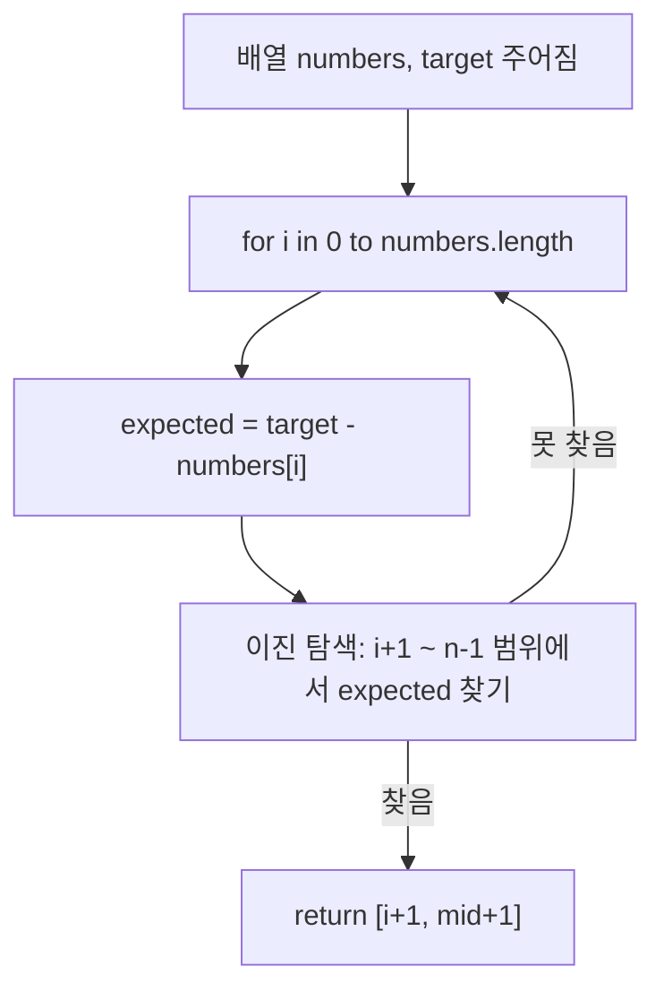

# Chapter 00-00
**LeetCode (Number). Title**

## Table of contents
1. [문제 설명](#1-문제-설명)
1. [문제 접근 방법](#2-문제-접근-방법)
1. [알고리즘 순서도](#3-알고리즘-순서도)
1. [코드](#4-코드)
1. [복잡도 분석](#5-복잡도-분석)
1. [예상 질문](#6-예상-질문)
1. [다른 풀이 방법](#7-다른-풀이-방법)

---

## 1. 문제 설명

```text
Given a 1-indexed array of integers numbers that is already sorted in non-decreasing order, find two numbers such that they add up to a specific target number. Let these two numbers be numbers[index1] and numbers[index2] where 1 <= index1 < index2 <= numbers.length.

Return the indices of the two numbers, index1 and index2, added by one as an integer array [index1, index2] of length 2.

The tests are generated such that there is exactly one solution. You may not use the same element twice.

Your solution must use only constant extra space.

---

<!-- 해설 -->
- 정렬된 정수 배열 numbers 와 정수 target 이 주어짐  
- 배열에서 두 수를 더해 target을 만들 수 있는 인덱스 두 개를 찾아 반환  
- 단, 배열은 1-indexed 기준이며 정답은 유일하게 존재함
```

### Constraints:
- 2 ≤ numbers.length ≤ 3 * 10⁴
- -1000 ≤ numbers[i] ≤ 1000
- numbers is sorted in non-decreasing order.
- 1000 <= target <= 1000
- The tests are generated such that there is exactly one solution. (정답이 반드시 존재함)


### 예시

```bash
Input: numbers = [2,7,11,15], target = 9
Output: [1,2]
Explanation: The sum of 2 and 7 is 9. Therefore, index1 = 1, index2 = 2. We return [1, 2].

---
# 배열은 1-indexed 기준이므로, 인덱스에 1씩 더함
Input: numbers = [2, 7, 11, 15], target = 9  
Output: [1, 2]  
Explanation: numbers[0] + numbers[1] == 9 → return [1 + 1, 2 + 1]
```

---

## 2. 문제 접근 방법

### 핵심 아이디어 💡
- 배열이 오름차순 정렬되어 있으므로, 이진 탐색 또는 투 포인터를 사용할 수 있다.
- 각 요소를 기준으로 나머지 값을 찾는 방식이다.
- 탐색 대상 값: expected = target - numbers[i]
- numbers[i + 1] ~ numbers[n - 1] 사이에서 expected를 이진 탐색으로 찾음

⸻

---

## 3. 알고리즘 순서도



### 값의 변화 과정
- numbers = [2, 7, 11, 15]
- target = 9

| i (외부 반복) | numbers[i] | expected | left 초기값 | right 초기값 | mid 계산식                          | mid 인덱스 | numbers[mid] | 비교 결과                | 다음 left/right |
|---------------|------------|----------|-------------|--------------|-------------------------------------|------------|---------------|--------------------------|-----------------|
| 0             | 2          | 7        | 1           | 3            | `Math.floor(1 + (3-1)/2) = 2`       | 2          | 11            | 11 > 7 → 줄여야 함       | right = 1       |
| 0             | 2          | 7        | 1           | 1            | `Math.floor(1 + (1-1)/2) = 1`       | 1          | 7             | 7 == 7 → 정답 찾음       | 종료            |

- numbers[0] = 2
- expected = target - numbers[0] = 9 - 2 = 7
- 이 expected 값을 numbers[1] ~ numbers[3] 범위에서 이진 탐색으로 찾아야 함

___

## 4. 코드

### 풀이 코드

- left = 1, right = 3
- mid = Math.floor(1 + (3 - 1) / 2) = 2 → numbers[2] = 11 (expected보다 크니까 → right = 1)
- 다시 mid = Math.floor(1 + (1 - 1) / 2) = 1 → numbers[1] = 7 → 일치함 → 정답 [1, 2] 반환

```ts
// numbers = [2, 7, 11, 15]
// target = 9
function twoSum(numbers: number[], target: number): number[] {
  for (let i = 0; i < numbers.length; i++) {
    let left = i + 1;
    let right = numbers.length - 1;
    const expected = target - numbers[i];

    while (left <= right) {
      const mid = left + (right - left) / 2;
      - `(right - left) / 2` → `>>> 1` 사용하면 타입 안정성 확보 (JS/TS 기준)

      if (numbers[mid] < expected) {
        left = mid + 1;
      } else if (numbers[mid] > expected) {
        right = mid - 1;
      } else {
        return [i + 1, mid + 1] as number[];
      }
    }
  }

  return [];
}
```

---

## 5. 복잡도 분석

### 코드 분석
코드를 살펴보며 시간복잡도 및 공간 복잡도 분석

```ts
// TC: 외부 루프 O(n) × 내부 이진 탐색 O(log n) = O(n log n)
// SC: 추가적인 자료구조 사용 없으므로 상수 공간
function twoSum(numbers: number[], target: number): number[] {
  for (let i = 0; i < numbers.length; i++) { // TC: 배열의 각 원소 순회: O(n)
    let left = i + 1;
    let right = numbers.length - 1;
    const expected = target - numbers[i];

    while (left <= right) { // TC: 범위 i+1 ~ n-1, 내부 이진 탐색 O(log n)
      // const mid = left + (right - left) / 2;
      const mid = (left + right) >>> 1; // `>>> 1`을 사용하면 타입 안정성 확보 (JS/TS 기준)

      if (numbers[mid] < expected) {
        left = mid + 1;
      } else if (numbers[mid] > expected) {
        right = mid - 1;
      } else {
        return [i + 1, mid + 1] as number[];
      }
    }
  }

  return [];
}
```

### 시간 복잡도 ⏳
> 1.	반복문의 실행 횟수를 먼저 보기
> 2.	반복 안에서 실행되는 연산 수를 체크
> 3.	입력의 크기(n)에 따라 얼마나 시간이 늘어나는지 판단

- 외부 반복문: `for i = 0 to n-1`
  - 배열의 각 원소를 한 번씩 순회
  - 실행 횟수: O(n)
- 내부 이진 탐색: `while (left <= right)`
  - 범위: i+1 ~ n-1
  - 최대 깊이: log(n - i)
  - 최악의 경우 (i = 0): log(n)

### 공간 복잡도 🗃️
> 1. 배열, 객체 등 추가적인 자료구조를 새로 만들었는지 보기
> 2. 그 자료구조의 크기가 입력 크기(n)에 비례하는지 체크
> 3. 변수만 사용한 경우는 O(1)로 봄

- 입력 배열 numbers: 문제에서 주어짐 (입력 자체)
- 변수: `i`, `left`, `right`, `mid`, `expected` → 상수개 변수 (O(1))
- 반환 값: `number[]` (정답 쌍 2개) → O(1)

- **공간 복잡도: O(1)**

> 추가적인 자료구조 사용 없으므로 상수 공간

### Big-O 분석 요약
- 평균 시간 복잡도: O(n log n)
- 최악 시간 복잡도: O(n log n)
- 공간 복잡도: O(1)

---

## 6. 내용 정리

### 3줄 요약 (Summary)
- 정렬된 배열에서 두 수의 합이 target이 되는 쌍을 찾는 문제
- 핵심은 정렬 상태를 활용하여 이진 탐색 또는 투 포인터 사용
- 시간 복잡도는 O(n log n), 공간 복잡도는 O(1)

### 이번 문제를 통해 배운 점
- 정렬된 배열 + 타겟 조합 문제에서 이진 탐색 또는 투 포인터를 활용할 수 있음
- 이진 탐색은 구현이 조금 더 복잡하지만, 특정 범위 내 빠른 탐색에 유리함
- 구현 복잡도가 높은 경우라도 시간복잡도 상 이점이 있다면 면접에서 언급 가치는 있음

### 질문 & 한 줄 답변
- 이진 탐색을 쓸 수 있는 이유는? → 정렬 조건이 충족되기 때문
- `Math.floor()`를 써야 하는 이유는? → 인덱스는 정수여야 하며, 나눗셈 결과가 소수이므로
- 투 포인터와 비교할 때, 이진 탐색 방식의 장점과 단점은?
	- 장점: 정렬 되어 있으면 중간값 기준으로 빠르게 찾을 수 있음
	- 단점: 상대적으로 구현이 복잡하고, 투 포인터보다 시간이 더 걸릴 수 있음

---

## 7. 다른 풀이

### 다른 풀이 방법
- 이진 탐색: 각 원소에 대해 이진 탐색을 수행. 정렬된 배열에서 가능하지만 반복문 + 이진 탐색 구조로 약간 
복잡
- 투 포인터: 포인터 2개로 양쪽에서 탐색. 구현이 직관적이고 빠름. 문제의 조건에 최적화된 풀이
- 해시맵 (일반적인 Two Sum): 정렬되지 않은 배열에서는 HashMap을 통해 풀이. 이 문제에서는 공간 제한 때문에 부적합

### 다른 풀이 방법을 사용하지 않은 이유
- 브루트포스: O(n²) → 시간 초과
- HashMap 방식: 공간 제한 조건 위배 (O(n) 필요)
- 이진 탐색: O(n log n)이지만, 공간 O(1) 만족

### 풀이 방법간 비교
| 풀이 방식        | 시간 복잡도  | 공간 복잡도   | 구현 난이도  |
|------------------|--------------|---------------|--------------|
| 이진 탐색        | O(n log n)   | O(1)          | 중           |
| 투 포인터        | O(n)         | O(1)          | 하           |
| 해시맵 (Two Sum) | O(n)         | O(n)          | 하           |
